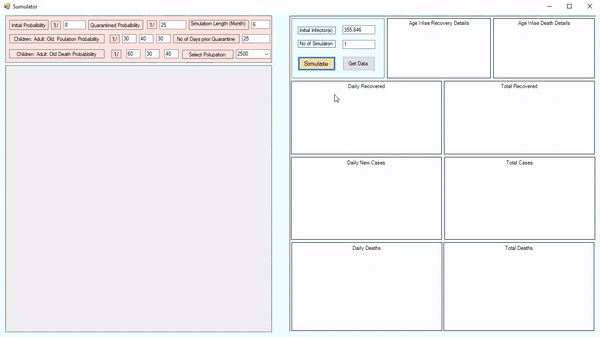

# COVID-19-Simulation
Monte Carlo Simulation of Covid-19 using Windows Forms.
The user must provide attributes like length of simulation, number of people affected etc. 
Then the simulator runs a simulation and shows live data. 
The data can be extracted on a text file by presssing "Get Data" button.
A running demo is shown below.

